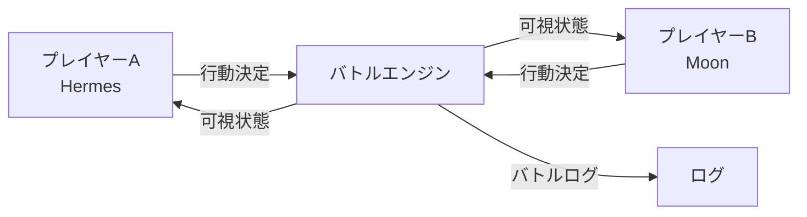
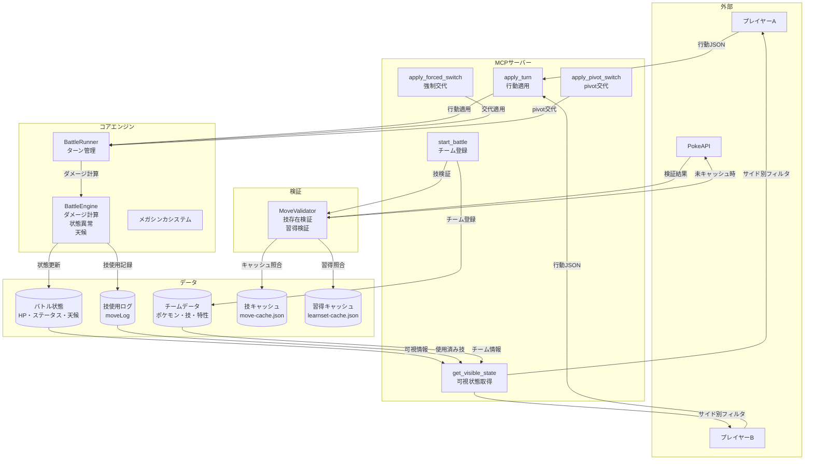
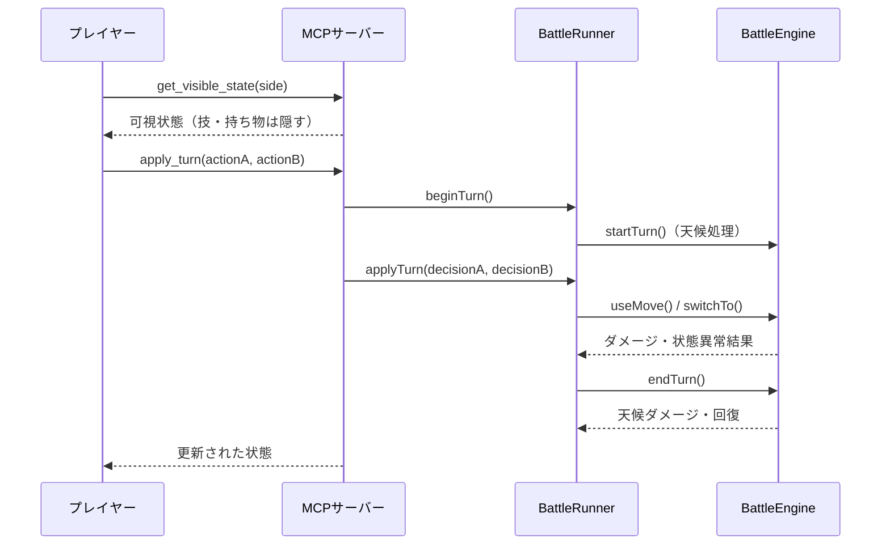
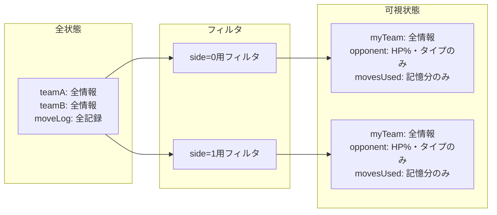
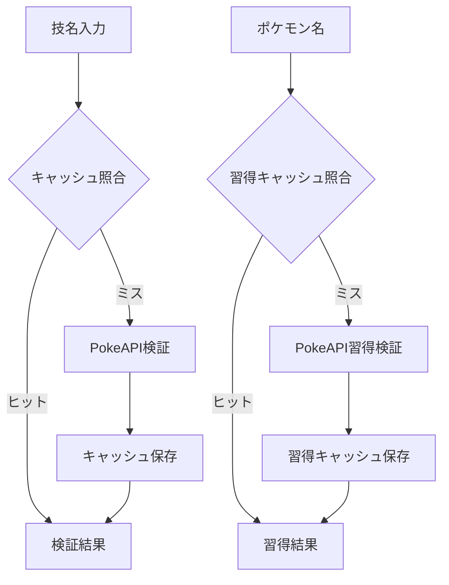

# ポケモンチャンピオンズ バトルエンジン 簡易DFD

## レベル0: コンテキスト図

```mermaid
graph LR
    P1[プレイヤーA<br/>Hermes] -->|行動決定| E[バトルエンジン]
    P2[プレイヤーB<br/>Moon] -->|行動決定| E
    E -->|可視状態| P1
    E -->|可視状態| P2
    E -->|バトルログ| LOG[ログ]
```

## レベル1: 主要プロセス

```mermaid
flowchart TD
    subgraph 外部
        P1[プレイヤーA]
        P2[プレイヤーB]
        PokeAPI[PokeAPI]
    end

    subgraph MCPサーバー
        START[start_battle<br/>チーム登録]
        STATE[get_visible_state<br/>可視状態取得]
        TURN[apply_turn<br/>行動適用]
        SWITCH[apply_forced_switch<br/>強制交代]
        PIVOT[apply_pivot_switch<br/>pivot交代]
    end

    subgraph コアエンジン
        RUNNER[BattleRunner<br/>ターン管理]
        ENGINE[BattleEngine<br/>ダメージ計算<br/>状態異常<br/>天候]
        MEGA[メガシンカシステム]
    end

    subgraph データ
        TEAM[(チームデータ<br/>ポケモン・技・特性)]
        STATE_D[(バトル状態<br/>HP・ステータス・天候)]
        MOVELOG[(技使用ログ<br/>moveLog)]
        CACHE[(技キャッシュ<br/>move-cache.json)]
        LEARN[(習得キャッシュ<br/>learnset-cache.json)]
    end

    subgraph 検証
        VALIDATOR[MoveValidator<br/>技存在検証<br/>習得検証]
    end

    P1 -->|行動JSON| TURN
    P2 -->|行動JSON| TURN
    START -->|チーム登録| TEAM
    START -->|技検証| VALIDATOR
    VALIDATOR -->|キャッシュ照合| CACHE
    VALIDATOR -->|習得照合| LEARN
    VALIDATOR -->|未キャッシュ時| PokeAPI
    PokeAPI -->|検証結果| VALIDATOR

    TURN -->|行動適用| RUNNER
    SWITCH -->|交代適用| RUNNER
    PIVOT -->|pivot交代| RUNNER
    RUNNER -->|ダメージ計算| ENGINE
    ENGINE -->|状態更新| STATE_D
    ENGINE -->|技使用記録| MOVELOG

    STATE -->|サイド別フィルタ| P1
    STATE -->|サイド別フィルタ| P2
    STATE_D -->|可視情報| STATE
    MOVELOG -->|使用済み技| STATE
    TEAM -->|チーム情報| STATE
```

## データフロー詳細

### 行動決定フロー

```mermaid
sequenceDiagram
    participant P as プレイヤー
    participant MCP as MCPサーバー
    participant R as BattleRunner
    participant E as BattleEngine

    P->>MCP: get_visible_state(side)
    MCP-->>P: 可視状態（技・持ち物は隠す）
    P->>MCP: apply_turn(actionA, actionB)
    MCP->>R: beginTurn()
    R->>E: startTurn()（天候処理）
    MCP->>R: applyTurn(decisionA, decisionB)
    R->>E: useMove() / switchTo()
    E-->>R: ダメージ・状態異常結果
    R->>E: endTurn()
    E-->>R: 天候ダメージ・回復
    MCP-->>P: 更新された状態
```

### 不完全情報フロー

```mermaid
flowchart LR
    subgraph 全状態
        FULL[teamA: 全情報<br/>teamB: 全情報<br/>moveLog: 全記録]
    end

    subgraph フィルタ
        F0[side=0用フィルタ]
        F1[side=1用フィルタ]
    end

    subgraph 可視状態
        V0[myTeam: 全情報<br/>opponent: HP%・タイプのみ<br/>movesUsed: 記憶分のみ]
        V1[myTeam: 全情報<br/>opponent: HP%・タイプのみ<br/>movesUsed: 記憶分のみ]
    end

    FULL --> F0 --> V0
    FULL --> F1 --> V1
```

## 技検証フロー（2層構造）

```mermaid
flowchart TD
    INPUT[技名入力] --> CACHE_CHECK{キャッシュ照合}
    CACHE_CHECK -->|ヒット| RESULT[検証結果]
    CACHE_CHECK -->|ミス| POKEAPI[PokeAPI検証]
    POKEAPI --> SAVE[キャッシュ保存]
    SAVE --> RESULT

    POKEMON[ポケモン名] --> LEARN_CHECK{習得キャッシュ照合}
    LEARN_CHECK -->|ヒット| LEARN_RESULT[習得結果]
    LEARN_CHECK -->|ミス| POKEAPI2[PokeAPI習得検証]
    POKEAPI2 --> LEARN_SAVE[習得キャッシュ保存]
    LEARN_SAVE --> LEARN_RESULT
```
